# Enterprise Services to MCP Tools for LLMs and Agentic AI


## 1. Executive Summary

This project demonstrates a practical enterprise pattern for making internal company services usable by Large Language Models (LLMs) and AI agents.

Most organizations already have valuable services inside existing systems:

- Customer management
- Product catalogs
- Order management
- Case management
- Legal services
- HR services
- Finance workflows
- IT support services
- Document processing
- Approval workflows
- Reporting and analytics

Normally, these services are locked behind applications, portals, databases, or internal APIs. An LLM cannot safely use them unless they are exposed through a controlled tool interface.

This project shows how to convert enterprise capabilities into:

1. **FastAPI APIs** — deterministic backend services.
2. **MCP tools** — LLM-ready wrappers around those APIs.
3. **OpenAI Agent / Chat Client** — a ChatGPT-like assistant that can call the MCP tools.
4. **Secure execution layer** — authentication, controlled tool exposure, and clear production hardening steps.

The main idea:

> Do not connect the LLM directly to your database or internal systems.  
> Build safe APIs first, wrap selected actions as MCP tools, then let the LLM call only those approved tools.

---

## 2. Mission of This Project

The mission is to provide a clear blueprint for transforming existing institutional services into LLM-callable capabilities.

In practical terms:

```text
Existing business service
        ↓
Backend API
        ↓
MCP Server Tool
        ↓
LLM / Agentic AI
        ↓
Natural language user experience
```

Example:

```text
"Create a customer order for Samer for the MCP Integration Package"
        ↓
LLM understands the intent
        ↓
LLM calls MCP tool: search_customers
        ↓
LLM calls MCP tool: list_products
        ↓
LLM calls MCP tool: create_order
        ↓
Backend API creates the order
        ↓
Assistant explains the result to the user
```

This pattern can be reused for any institution that wants to make its services available through AI assistants without losing control, security, auditability, or governance.

---

## 3. Why MCP Matters

MCP stands for **Model Context Protocol**.

It is a standard way for AI applications and agents to connect to external tools, systems, files, APIs, and business services.

Think of MCP as a controlled gateway between:

- The **LLM**, which understands user intent.
- The **enterprise systems**, which execute real business operations.

MCP allows the LLM to see a list of available tools, understand their descriptions and input schemas, then call them when needed.

Without MCP, every application may expose tools differently. With MCP, tools become standardized and reusable across AI clients and agents.

---

## 4. What This Repository Contains

```text
company-api-mcp-openai/
├─ app/
│  ├─ api_server.py
│  ├─ mcp_server.py
│  ├─ chat_client.py
│  ├─ models.py
│  └─ test_mcp_connection.py
├─ .env.example
├─ .gitignore
├─ requirements.txt
├─ README.md
├─ SECURITY.md
└─ .vscode/
   └─ tasks.json
```

### Main Files

| File | Purpose |
|---|---|
| `app/api_server.py` | FastAPI backend that exposes normal HTTP API endpoints. |
| `app/mcp_server.py` | MCP server that wraps selected API endpoints as LLM-callable tools. |
| `app/chat_client.py` | ChatGPT-like CLI client using OpenAI and the MCP server. |
| `app/models.py` | Pydantic models for validation and typed schemas. |
| `app/test_mcp_connection.py` | Smoke test to confirm MCP tools are visible. |
| `.env.example` | Example environment variables. Never commit real `.env`. |
| `.gitignore` | Prevents secrets, virtual environments, logs, and databases from being committed. |
| `SECURITY.md` | Security notes for safe use and production hardening. |

---

## 5. High-Level Architecture

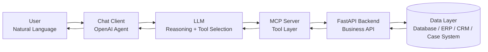

### Explanation

1. The user asks a question in natural language.
2. The LLM decides whether it needs a tool.
3. The MCP client discovers available MCP tools.
4. The LLM selects the correct tool.
5. The MCP server calls the internal FastAPI API.
6. The API executes business logic.
7. The result goes back to the LLM.
8. The LLM explains the result to the user.

---

## 6. Detailed API-MCP-LLM Communication Flow

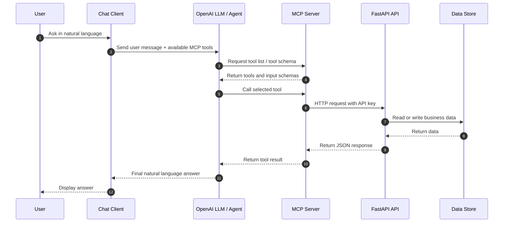

---

## 7. Component Responsibilities

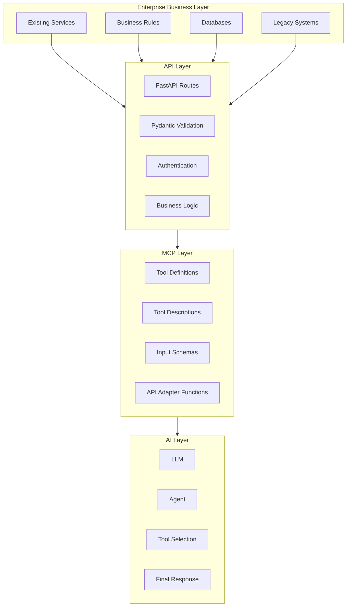

### FastAPI Layer

The FastAPI layer is responsible for real backend behavior:

- Validating inputs.
- Applying business rules.
- Reading and writing data.
- Enforcing backend authentication.
- Returning structured JSON.
- Publishing OpenAPI documentation.

The LLM should not bypass this layer.

### MCP Layer

The MCP layer is responsible for exposing only selected capabilities to LLMs:

- It defines safe tool names.
- It provides clear tool descriptions.
- It controls which API endpoints can be called.
- It normalizes errors.
- It hides unnecessary internal API complexity.
- It becomes the contract between the LLM and the organization.

### LLM / Agent Layer

The LLM layer is responsible for reasoning:

- Understanding the user request.
- Deciding whether a tool is needed.
- Selecting the correct MCP tool.
- Passing structured arguments.
- Explaining the result in human language.

The LLM should not make business decisions without guardrails. It should use tools to retrieve or execute real actions.

---

## 8. Service Transformation Methodology

Use this method to transform any enterprise service into an MCP-ready AI capability.

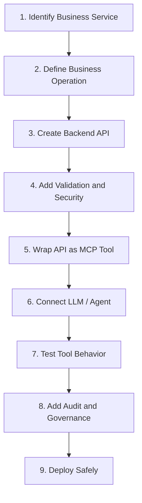

### Step 1: Identify Business Service

Examples:

- Create a customer.
- Search a case.
- Retrieve invoice status.
- Generate a legal memo.
- Create an IT ticket.
- Approve a request.
- Check employee leave balance.
- Summarize a document.

### Step 2: Define Business Operation

Every service should be written as a clear operation:

```text
Operation name: create_order
Input: customer_id, product_id, quantity
Output: order_id, total, status
Rules: customer must exist, product must exist, quantity must be valid
Risk level: medium
Human approval needed: no for demo, yes for production if financial impact exists
```

### Step 3: Create Backend API

Example API endpoint:

```http
POST /orders
```

Request:

```json
{
  "customer_id": "cus_001",
  "items": [
    {
      "product_id": "prd_002",
      "quantity": 1
    }
  ]
}
```

Response:

```json
{
  "id": "ord_123",
  "customer_id": "cus_001",
  "total": 12000,
  "currency": "AED",
  "status": "created"
}
```

### Step 4: Wrap the API as MCP Tool

Example MCP tool:

```python
@mcp.tool()
async def create_order(customer_id: str, product_id: str, quantity: int = 1):
    """Create a new order for an existing customer and product."""
    return await call_api(
        "POST",
        "/orders",
        json={
            "customer_id": customer_id,
            "items": [{"product_id": product_id, "quantity": quantity}],
        },
    )
```

### Step 5: Let the LLM Call the Tool

The user says:

```text
Create an order for Samer for the MCP Integration Package.
```

The LLM should:

1. Search customer.
2. Search products.
3. Confirm correct IDs.
4. Call `create_order`.
5. Explain the result.

---

## 9. Tool Exposure Design

Not every API endpoint should become an MCP tool.

Use this rule:

> Expose business actions, not raw technical endpoints.

### Good MCP Tools

| Good Tool | Why |
|---|---|
| `search_customers` | Clear, safe, read-only. |
| `list_products` | Clear, safe, read-only. |
| `create_order` | Business action with validation. |
| `get_order_status` | Useful and controlled. |
| `summarize_case` | AI-friendly business capability. |
| `create_support_ticket` | Clear enterprise workflow. |

### Bad MCP Tools

| Bad Tool | Why |
|---|---|
| `execute_sql` | Dangerous, uncontrolled database access. |
| `call_any_endpoint` | Gives the LLM too much freedom. |
| `delete_user` | High-risk without approval. |
| `update_any_record` | Too broad and unsafe. |
| `run_shell_command` | Dangerous unless heavily sandboxed. |

---

## 10. Security Boundary

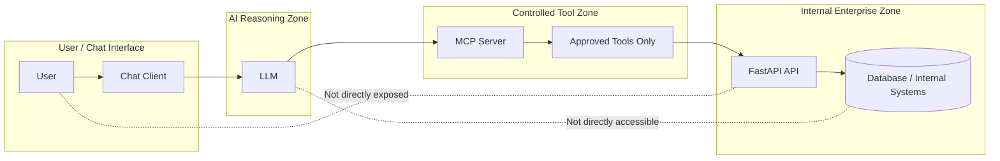

### Security Principles

1. Never expose the database directly to the LLM.
2. Never give the LLM a generic admin API.
3. Use narrow, well-described tools.
4. Validate all inputs at the API layer.
5. Authenticate MCP-to-API calls.
6. Add audit logs for write actions.
7. Add human approval for high-risk operations.
8. Keep `.env` out of GitHub.
9. Rotate keys if they are ever leaked.
10. Use private repositories for internal systems.

---

## 11. Read vs Write Tool Policy

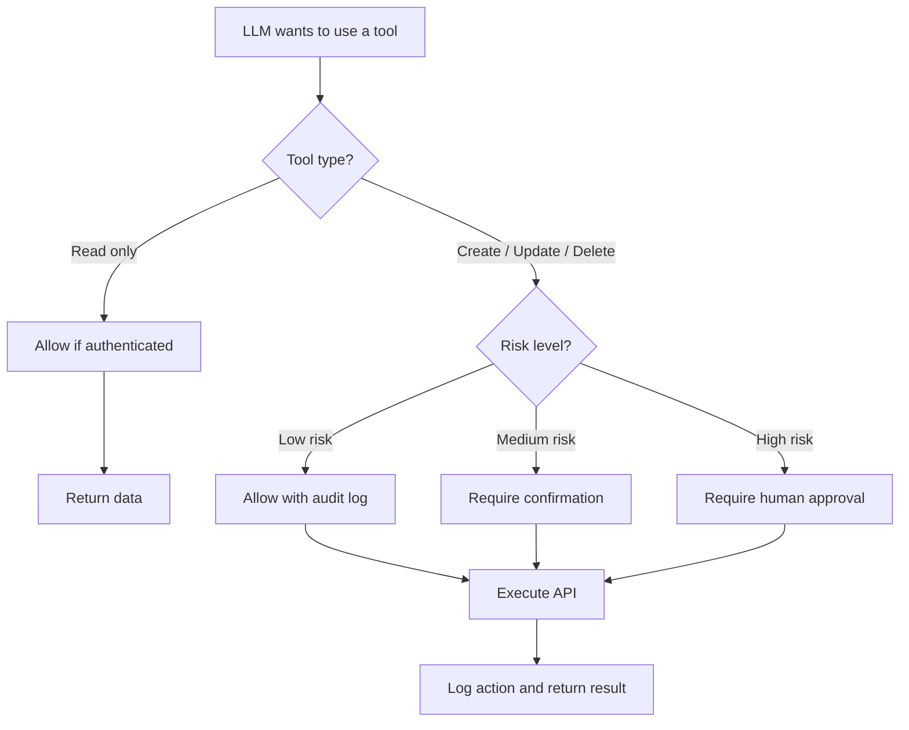

### Recommended Policy

| Tool Type | Example | Requirement |
|---|---|---|
| Read-only | Search customer, list products | Authentication + logging |
| Low-risk write | Create support ticket | Authentication + audit |
| Medium-risk write | Create order, update profile | Confirmation + audit |
| High-risk write | Delete account, approve payment | Human approval + audit |
| Critical action | Legal filing, payment release | Human workflow + segregation of duties |

---

## 12. How the Current Demo Works

This demo contains a simple company API with:

- Customers
- Products
- Orders

The MCP server exposes selected tools:

| MCP Tool | Purpose |
|---|---|
| `api_health` | Check whether the backend API is alive. |
| `search_customers` | Search or list customers. |
| `create_customer` | Create a new customer. |
| `list_products` | List available products. |
| `create_order` | Create an order for a customer. |
| `get_orders_for_customer` | Retrieve customer orders. |

The chat client connects an OpenAI agent to the MCP server. The user can ask naturally:

```text
List products.
```

```text
Find customer Samer.
```

```text
Create an order for customer cus_001 for the MCP Integration Package.
```

The assistant will call MCP tools instead of inventing data.

---

## 13. Local Setup

### 13.1 Create Virtual Environment

```bash
python -m venv .venv
```

Windows PowerShell:

```powershell
.\.venv\Scripts\Activate.ps1
```

macOS/Linux:

```bash
source .venv/bin/activate
```

### 13.2 Install Requirements

```bash
pip install -r requirements.txt
```

### 13.3 Create Environment File

Copy the example file:

```bash
cp .env.example .env
```

Windows PowerShell:

```powershell
Copy-Item .env.example .env
```

Edit `.env`:

```env
OPENAI_API_KEY=replace_with_your_openai_api_key
OPENAI_MODEL=gpt-5.5

API_BASE_URL=http://127.0.0.1:9000
MCP_URL=http://127.0.0.1:8000/mcp

API_KEY=change-this-dev-key
```

Never commit `.env` to GitHub.

---

## 14. Run the Project

### Terminal 1 — Run FastAPI

```bash
python -m uvicorn app.api_server:app --reload --port 9000
```

Open:

```text
http://127.0.0.1:9000/docs
```

Test health endpoint:

```bash
curl -H "X-API-Key: change-this-dev-key" http://127.0.0.1:9000/health
```

Windows PowerShell:

```powershell
curl.exe -H "X-API-Key: change-this-dev-key" http://127.0.0.1:9000/health
```

### Terminal 2 — Run MCP Server

```bash
python -m app.mcp_server
```

MCP endpoint:

```text
http://127.0.0.1:8000/mcp
```

### Terminal 3 — Test MCP Tool Discovery

```bash
python -m app.test_mcp_connection
```

Expected output:

```text
MCP tools found:
- api_health
- search_customers
- create_customer
- list_products
- create_order
- get_orders_for_customer
```

### Terminal 4 — Run Chat Client

```bash
python -m app.chat_client
```

Try:

```text
list products
```

```text
find customer Samer
```

```text
create an order for customer cus_001 for MCP Integration Package
```

```text
show orders for cus_001
```

---

## 15. VS Code Workflow

You can run everything from VS Code.

1. Open the project folder.
2. Create `.env` from `.env.example`.
3. Install dependencies.
4. Open **Terminal > Run Task**.
5. Run:
   - `Run FastAPI API`
   - `Run MCP Server`
   - `Run Chat Client`

The file `.vscode/tasks.json` contains ready tasks.

---

## 16. Example Enterprise Use Cases

### Government / Legal Sector

| Service | API | MCP Tool |
|---|---|---|
| Search case | `GET /cases` | `search_cases` |
| Summarize investigation | `POST /cases/{id}/summary` | `summarize_case` |
| Draft legal memo | `POST /memos` | `draft_legal_memo` |
| Check hearing date | `GET /hearings` | `get_hearing_date` |
| Translate document | `POST /translation` | `translate_document` |
| Classify crime | `POST /crime-classification` | `classify_crime` |

### HR Sector

| Service | API | MCP Tool |
|---|---|---|
| Employee profile | `GET /employees/{id}` | `get_employee_profile` |
| Leave balance | `GET /leave/balance` | `get_leave_balance` |
| Submit leave request | `POST /leave/requests` | `create_leave_request` |
| HR policy search | `GET /policies` | `search_hr_policy` |

### IT Service Management

| Service | API | MCP Tool |
|---|---|---|
| Create ticket | `POST /tickets` | `create_it_ticket` |
| Check ticket status | `GET /tickets/{id}` | `get_ticket_status` |
| Search knowledge base | `GET /kb` | `search_knowledge_base` |
| Escalate incident | `POST /incidents/{id}/escalate` | `escalate_incident` |

### Finance

| Service | API | MCP Tool |
|---|---|---|
| Invoice lookup | `GET /invoices` | `search_invoices` |
| Payment status | `GET /payments/{id}` | `get_payment_status` |
| Budget summary | `GET /budgets` | `get_budget_summary` |
| Expense submission | `POST /expenses` | `submit_expense` |

---

## 17. Enterprise Design Pattern

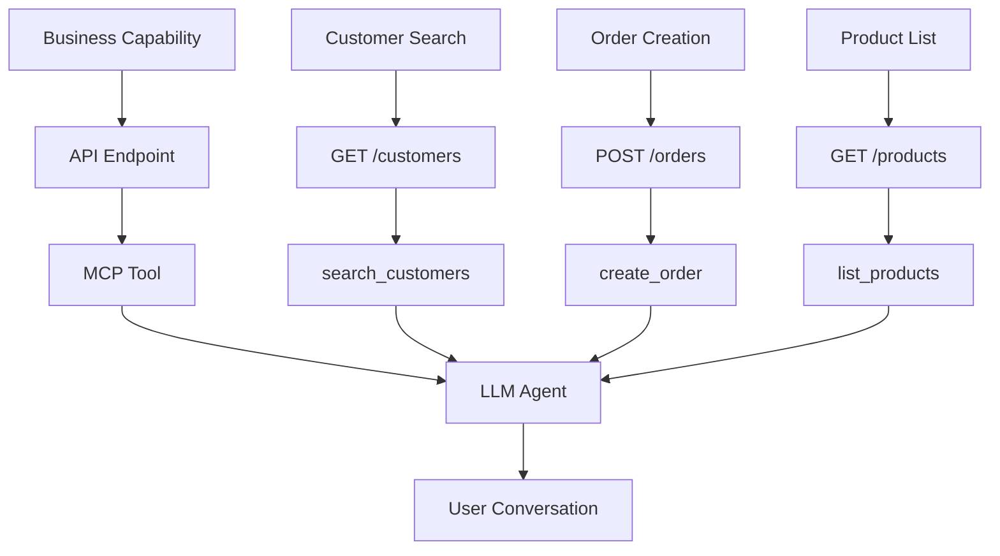

This is the recommended enterprise approach:

```text
One business operation
        =
One validated API endpoint
        =
One narrow MCP tool
        =
One safe LLM capability
```

---

## 18. API Design Rules for LLM Readiness

When designing APIs for MCP and LLM use, follow these rules:

### 18.1 Make Operations Explicit

Bad:

```text
POST /execute
```

Good:

```text
POST /orders
GET /customers
GET /orders/customer/{customer_id}
```

### 18.2 Use Strong Schemas

Use Pydantic models with clear field names:

```python
class OrderCreate(BaseModel):
    customer_id: str
    items: list[OrderLine]
```

### 18.3 Return Useful JSON

Bad:

```json
{"ok": true}
```

Good:

```json
{
  "id": "ord_123",
  "status": "created",
  "total": 12000,
  "currency": "AED"
}
```

### 18.4 Give Tools Clear Descriptions

Bad:

```python
"""Call API."""
```

Good:

```python
"""Create a new order for an existing customer and product."""
```

### 18.5 Avoid Overly Broad Tools

Bad:

```python
run_api(method, path, body)
```

Good:

```python
search_customers(q)
create_order(customer_id, product_id, quantity)
```

---

## 19. Production Architecture

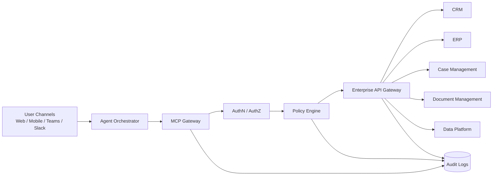

### Production Recommendations

For production, add:

- API gateway.
- OAuth2 or JWT authentication.
- Role-based access control.
- Tool-level authorization.
- Audit logs.
- Rate limiting.
- Request tracing.
- Human approval workflow.
- Secrets management.
- Monitoring and alerting.
- Data loss prevention.
- Prompt injection defenses.
- Environment separation: dev, test, staging, production.

---

## 20. Governance Model

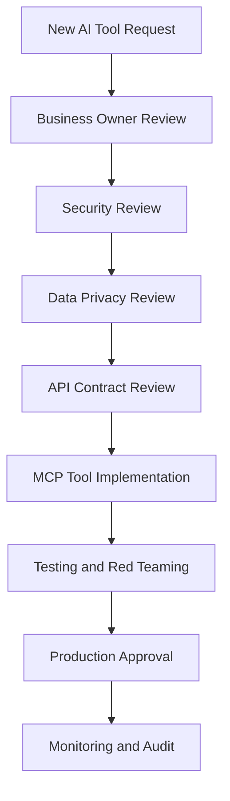

### Governance Questions

Before exposing a tool to an LLM, answer:

1. What business process does this tool support?
2. Who owns the service?
3. What data does it access?
4. Does it read, create, update, or delete records?
5. What is the worst possible misuse?
6. Does it need human approval?
7. What logs are required?
8. Which users or roles may access it?
9. What should the tool refuse to do?
10. How will errors be handled?

---

## 21. Data Privacy and Safety

Never include real sensitive information in public repositories.

Avoid committing:

- Real API keys
- Real customer names
- Real phone numbers
- Real emails
- Real case numbers
- Real invoices
- Real government data
- Real internal URLs
- Real production credentials
- Real database dumps

Use demo values only:

```text
samer@example.com
+971500000000
cus_001
ord_001
```

If a real key is accidentally pushed:

1. Delete it from the repository.
2. Rotate the key immediately.
3. Check Git history.
4. Consider the key compromised.
5. Move secrets to environment variables or a secret manager.

---

## 22. Testing Strategy

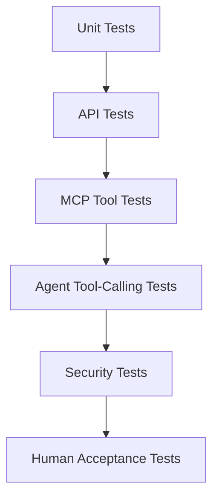

Recommended tests:

| Test Type | What to Test |
|---|---|
| API test | Endpoint returns correct JSON. |
| Auth test | Missing API key is rejected. |
| Schema test | Invalid inputs are rejected. |
| MCP test | Tools are discoverable. |
| Tool test | Tool calls correct API endpoint. |
| Agent test | LLM chooses the correct tool. |
| Safety test | LLM cannot call hidden APIs. |
| Audit test | Write actions are logged. |

---

## 23. Common Problems and Fixes

### Problem: `Invalid or missing X-API-Key header`

Reason: The API requires the header:

```text
X-API-Key: change-this-dev-key
```

Fix:

```powershell
curl.exe -H "X-API-Key: change-this-dev-key" http://127.0.0.1:9000/customers
```

### Problem: `ModuleNotFoundError: No module named 'email_validator'`

Fix:

```bash
pip install email-validator
```

Or:

```bash
pip install -r requirements.txt
```

### Problem: `fatal: not a git repository`

Fix:

```bash
git init
git branch -M main
```

### Problem: `.env` appears in Git status

Fix:

```bash
git rm --cached .env
```

Then confirm `.gitignore` contains:

```gitignore
.env
.env.*
!.env.example
```

---

## 24. From Demo to Real Enterprise System

To adapt this project to a real organization:

### Replace Demo Data

Current demo:

```python
customers: dict[str, Customer] = {...}
products: dict[str, Product] = {...}
orders: dict[str, Order] = {}
```

Production version:

```text
FastAPI
  ↓
Repository / Service Layer
  ↓
Database / CRM / ERP / Case System
```

### Add a Service Layer

Recommended structure:

```text
app/
├─ api/
│  └─ routes/
├─ services/
│  ├─ customers_service.py
│  ├─ orders_service.py
│  └─ products_service.py
├─ repositories/
│  └─ database_repository.py
├─ mcp/
│  └─ tools.py
└─ models/
   └─ schemas.py
```

### Add Enterprise Authentication

Replace demo API key with:

- OAuth2
- JWT
- Azure AD / Entra ID
- API Gateway tokens
- Mutual TLS for internal services

### Add Authorization

Authentication answers:

```text
Who are you?
```

Authorization answers:

```text
What are you allowed to do?
```

Every MCP tool should check authorization before calling sensitive APIs.

---

## 25. Recommended Tool Naming Convention

Use action-oriented names:

```text
search_customers
get_customer_profile
list_products
create_order
get_order_status
create_support_ticket
summarize_case
translate_document
classify_request
```

Avoid vague names:

```text
process
execute
run
handle
call_api
do_action
```

A good MCP tool name should be:

- Short
- Clear
- Action-based
- Domain-specific
- Safe
- Easy for the LLM to select

---

## 26. Recommended Tool Description Pattern

Each MCP tool should describe:

1. What it does.
2. When to use it.
3. What input it expects.
4. What it returns.
5. Any restriction.

Example:

```python
@mcp.tool()
async def search_customers(q: str | None = None):
    """
    Search company customers by name or email.
    Use this before creating an order when the user gives a customer name.
    Pass empty q only when the user asks to list all demo customers.
    Returns customer IDs, names, emails, phone numbers, and status.
    """
```

---

## 27. Agent Instructions

The agent should be instructed to:

- Use tools when business data is needed.
- Never invent IDs.
- Search before creating records.
- Confirm high-impact actions.
- Explain tool results clearly.
- Refuse unsafe requests.
- Avoid exposing secrets.
- Avoid pretending that an action was completed if the tool failed.

Example instruction:

```text
You are a helpful company API assistant.
Use MCP tools whenever the user asks about customers, products, orders, or backend API status.
Do not invent customer IDs, product IDs, or order IDs.
Look them up with tools first.
Before creating new records, summarize what you are about to create.
After a tool call, explain the result clearly and include important IDs.
```

---

## 28. Minimum Production Checklist

Before using this beyond local development:

- [ ] Repository is private if it contains internal business logic.
- [ ] `.env` is not committed.
- [ ] No real keys in Git history.
- [ ] No real customer or employee data in demo fixtures.
- [ ] API key changed from demo value.
- [ ] OAuth2/JWT/API Gateway added.
- [ ] MCP server is not publicly exposed without authentication.
- [ ] Write tools require audit logging.
- [ ] High-risk tools require human approval.
- [ ] Logs do not contain secrets.
- [ ] Monitoring is enabled.
- [ ] Rate limiting is enabled.
- [ ] Error messages do not expose internal details.
- [ ] Tool descriptions are clear and narrow.
- [ ] Prompt injection testing completed.
- [ ] Role-based authorization implemented.

---

## 29. Best-Practice Principle

The core principle of this architecture is:

```text
LLM understands.
MCP controls.
API executes.
Enterprise governs.
```

The LLM should not be the system of record.

The MCP server should not contain all business logic.

The API should remain deterministic and testable.

The enterprise should retain control through authentication, authorization, logging, governance, and approvals.

---

## 30. References

- Model Context Protocol Documentation: https://modelcontextprotocol.io/
- MCP Architecture Overview: https://modelcontextprotocol.io/docs/learn/architecture
- MCP Python SDK: https://github.com/modelcontextprotocol/python-sdk
- OpenAI Agents SDK — MCP: https://openai.github.io/openai-agents-python/mcp/
- FastAPI Documentation: https://fastapi.tiangolo.com/
- FastAPI OpenAPI Docs: https://fastapi.tiangolo.com/reference/openapi/docs/

---

## 31. License and Usage

This project is intended as an educational and technical blueprint for converting enterprise services into LLM-ready MCP tools.

Use it as a starting point for:

- Internal AI assistants.
- Agentic AI workflows.
- Government service assistants.
- Legal AI assistants.
- Enterprise automation.
- API modernization.
- AI-ready service catalogs.

Before production use, apply the security checklist and adapt the authentication, authorization, data layer, and audit model to your organization.

---

## 32. Final Concept

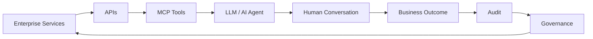

This is the bridge between traditional enterprise systems and the next generation of AI-powered operations.
